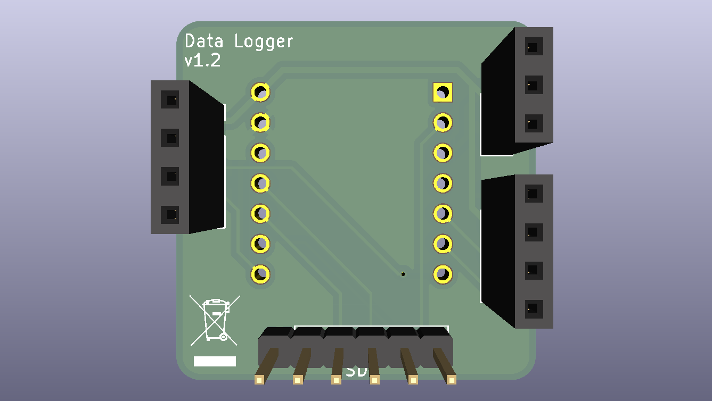
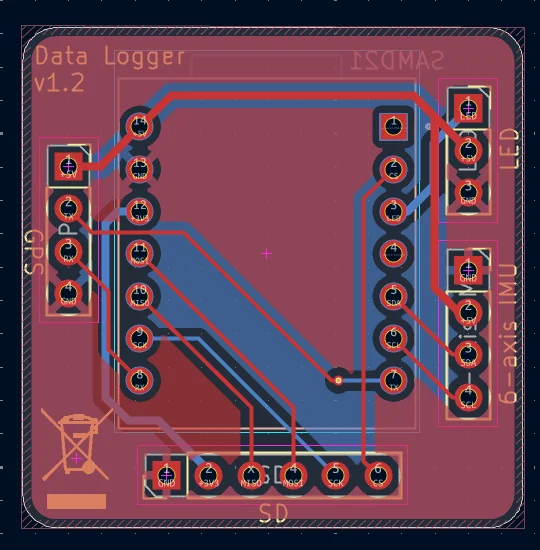
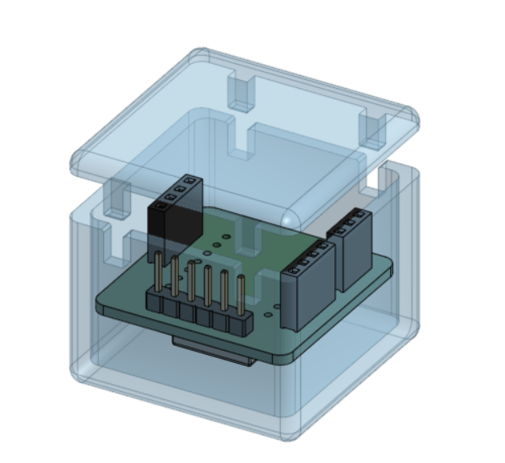
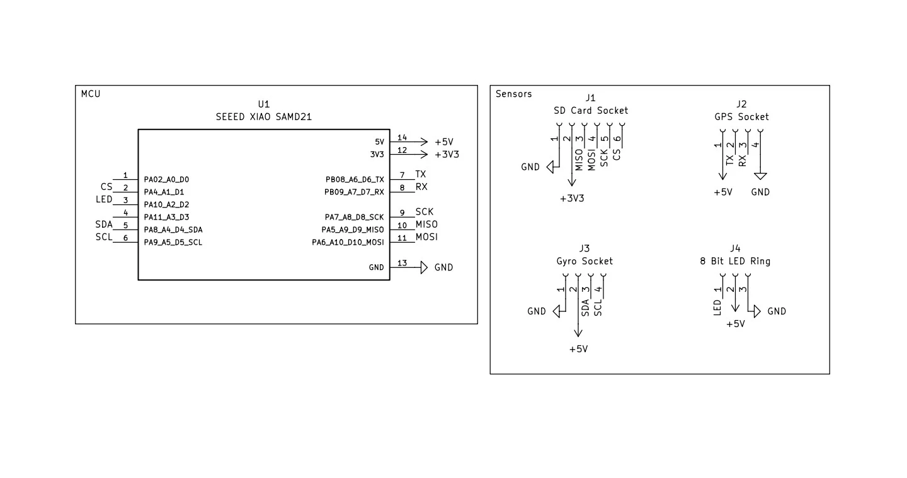

# Blackbox Drone Logger

Blackbox is a small drone telemetry logger built around a Seeed XIAO SAMD21. It sits on the drone, listens to the IMU and GPS, and writes everything to a microSD card so the flight data survives even if the airframe does not. lamo /j

I built it because I wanted a logger that felt like part of the drone, not an afterthought taped on the side. The whole point was to keep it compact, cheap enough to actually build.

## Media

### Full assembly

### PCB

### Top view

### Schematic

## What’s in the repo

- Journal: [JOURNAL.md](JOURNAL.md)
- Submission BOM: [BOM.csv](BOM.csv)
- Firmware: [firmware/](firmware/)

## Firmware

The firmware is a PlatformIO Arduino project for the XIAO SAMD21. It boots the IMU, listens for GPS sentences, and writes CSV rows to `/flight.csv` on the SD card.

---

### Onshape: [link](https://cad.onshape.com/documents/16e8a4c5b161029e325a2044/w/93c29fa5828ba80b97f8f047/e/c4410406f979bcbe292583a0?renderMode=0&uiState=6a0ef933e4e72416efe2d3e6)

---

## Hardware notes

- SD card chip select is routed to the XIAO D1 pin.
- I2C is on D4 and D5.
- GPS UART is on D6 and D7.
- SPI is on D8, D9, and D10.

## BOM

The submission BOM stays intentionally small. The total parts cost is about $45 before shipping, which keeps the project inside the cost target without turning it into a pile of extra parts.

| Name | Purpose | Quantity | Total Cost (USD) | Link | Distributor |
| --- | --- | ---: | ---: | --- | --- |
| LED Ring | for lighting | 1 | 0.50 | [product link](https://robu.in/product/8bit-ws2812-5050-rgb-led-built-full-color-driving-lights-circular-development-board/) | Robu |
| 6-axis IMU MPU6886 | Gyro and accelerometer | 1 | 9.80 | [product link](https://robu.in/product/m5stack-6-axis-imu-unit-mpu6886/) | Robu |
| NEO M8N | GPS coordinates | 1 | 10.00 | [product link](https://robu.in/product/apm2-5-ublox-neo-m8n-gps-module-gygpsv1-8m-3-5v-gygpsv5-neo-pixhawk-apm-ceramic-active-antenna/) | Robu |
| MicroSD Card Module | SD card module | 1 | 0.20 | [product link](https://www.robu.in/product/mini-micro-sd-card-reader-module/) | Robu |
| 3.7v 2500mah Battery | Battery | 1 | 6.50 | [product link](https://robu.in/product/wly104050-2500mah-3-7v-single-cell-rechargeable-lipo-battery/) | Robu |
| PCB | PCB | 1 | 10.00 | [product link](https://robu.in/) | Robu |
| XIAO SAMD21 | Microcontroller | 1 | 8.00 | [product link](https://robu.in/product/seeedstudio-seeeduino-xiao-pre-soldered/) | Robu |

Happy shipping : )